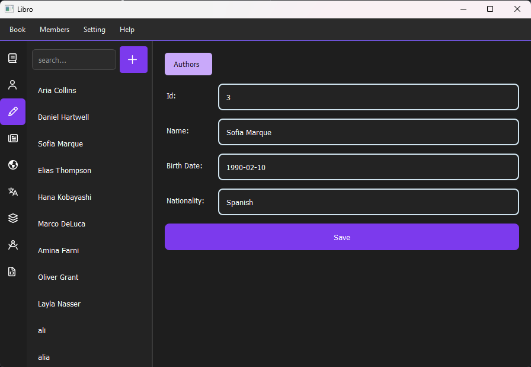
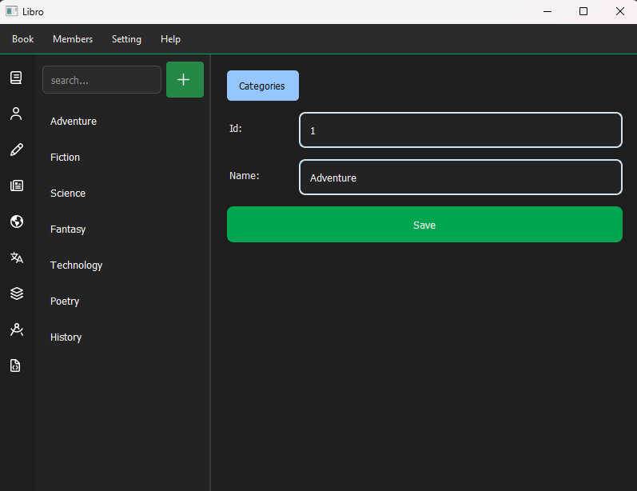

# Libro

 A desktop library management application developed using Python and PyQt5 that utilizes an SQLite database. This project enables the addition, searching, editing, and management of books—as well as all related entities (including authors, publishers, translators, cover designers, languages, categories, and sources)—through a graphical user interface.

|                             |  |
|-----------------------------|---------|
|  |  |

## ✨ What It Does

This program provides you with features to track all items in the library collection:

- 📖 **Books** : title, product code, age group, release date, and price , etc.
- ✍️ **Authors** : name, birthdate, and nationality
- 🏢 **Publishers** : name, address, and website
- 🌍 **Languages** : every language a book is available in
- 🗂️ **Categories** : genres and topics for organizing books
- 🎨 **Cover Designers** : who designed each book's cover
- 🌐 **Translators** : who translated a book, and into which language
- 📦 **Resources** : extra files or materials tied to a book

A single book can have multiple authors, languages, translators, and cover designers at once , so the app fits real-world books that aren't just "one author, one language."

---

## 🖥️ How It Looks and Works

The app opens with a clean layout:

- A slim **icon bar** on the far left to jump between sections (Books, Authors, Publishers, etc.)
- A **list panel** showing all entries for the selected section, with a **search box** at the top that filters the list live as you type
- A **details panel** on the right that opens when you click an item, showing its full information in an editable form
- A **Save** button on every form — click it, and the list on the left updates automatically to reflect your changes

Simple flow: **pick a section → search or browse → click an entry → edit → save.**

---

## 💻 System Requirements

- Windows 10 or later (64-bit)
- No additional software required — everything needed to run the app is bundled in the installer

---

## 📥 Installation

1. Download the latest installer: **`Libro.exe`**
2. Double-click the downloaded file to launch the installer.
3. If Windows SmartScreen shows a warning (common for new, unsigned apps), click **More info → Run anyway**.
4. Follow the on-screen steps in the setup wizard:
   - Choose an install location (or keep the default)
   - Choose whether to create a desktop shortcut
   - Click **Install**
5. Once installation finishes, click **Finish** to close the wizard.

The app is now installed and ready to use — no Python, no extra libraries, no manual setup required.

---

## ▶️ Running the App

- Launch it from the **desktop shortcut** (if you created one), or
- Open the **Start Menu** and search for **"Library Management System"**

---

## 🗑️ Uninstalling

- Open **Settings → Apps → Installed apps**
- Find **Library Management System** in the list
- Click **Uninstall** and follow the prompts

---

## 🛠️ Built With

- **Python** & **PyQt5** for the desktop interface
- **SQLite** for storing the data
